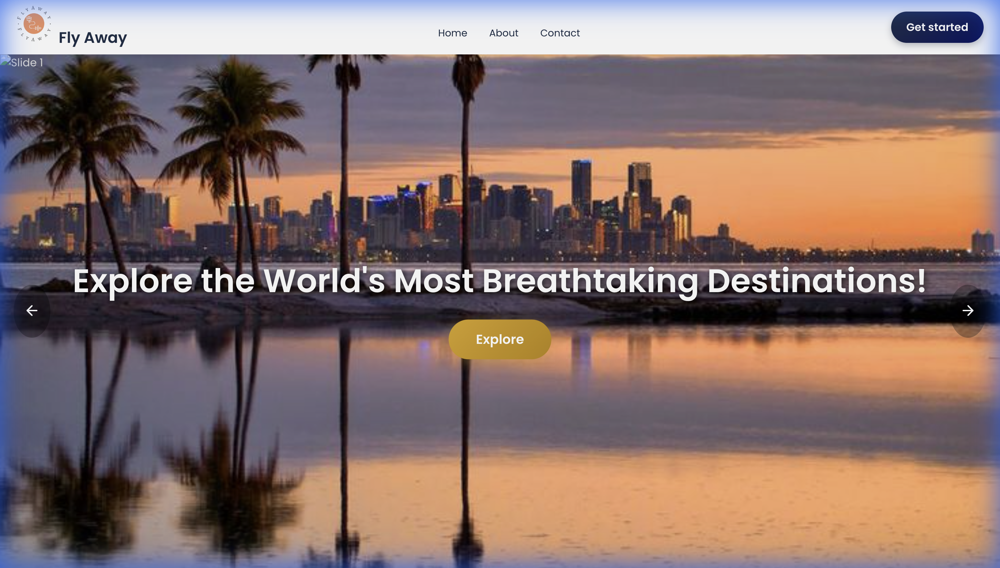
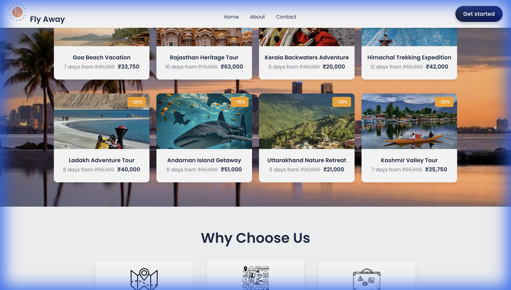
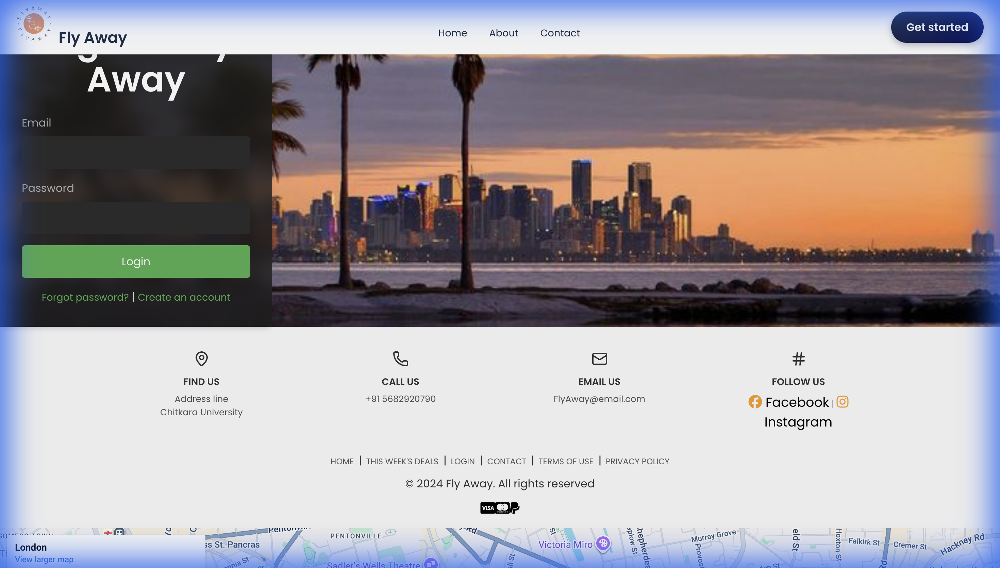
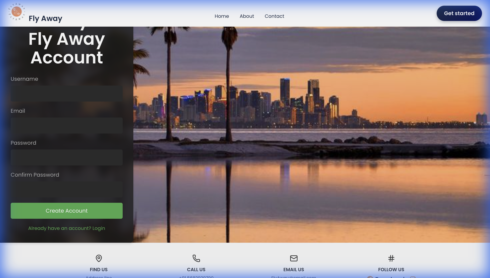
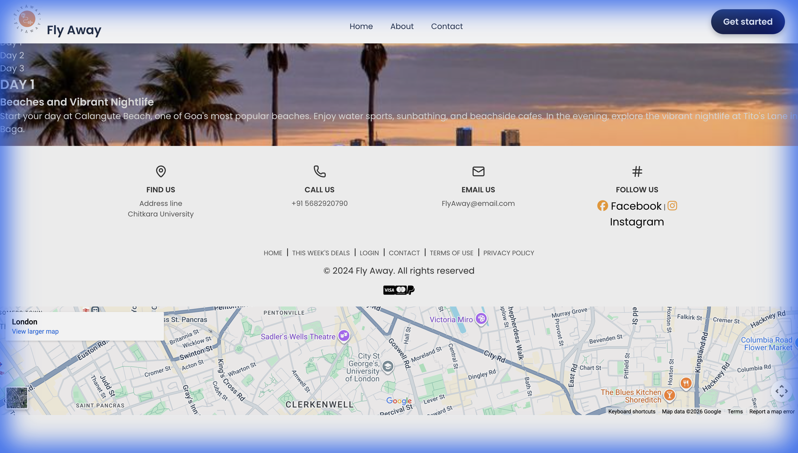

# ✈️ FLY AWAY - Travel Booking Website

A full-stack travel booking application built with React and Node.js, offering users a seamless experience to explore and book travel destinations across India.


## 📋 Table of Contents

- [Features](#-features)
- [Tech Stack](#-tech-stack)
- [Project Structure](#-project-structure)
- [Installation](#-installation)
- [Usage](#-usage)
- [API Endpoints](#-api-endpoints)
- [Screenshots](#-screenshots)
- [Contributing](#-contributing)
- [License](#-license)

## ✨ Features

- **🏠 Homepage** - Beautiful hero slideshow with stunning travel imagery
- **🎫 Travel Deals** - Browse discounted travel packages across India
- **🔍 Destination Search** - Search and explore popular destinations
- **📸 Photo Gallery** - Categorized galleries for Mountains, Beaches, and Historical sites
- **⭐ Reviews Carousel** - Customer testimonials and travel experiences
- **📊 Statistics** - Experience metrics and customer satisfaction data
- **🔐 Authentication** - Secure user login and registration system
- **📍 Google Maps Integration** - Embedded maps in footer for location reference
- **📱 Responsive Design** - Fully optimized for desktop and mobile devices

## 🛠️ Tech Stack

### Frontend
- **React 19** - UI library
- **React Router DOM** - Client-side routing
- **Vite** - Build tool and dev server
- **Lucide React** - Icon library
- **Axios** - HTTP client
- **CSS3** - Custom styling with parallax effects

### Backend
- **Node.js** - Runtime environment
- **Express.js** - Web framework
- **Sequelize** - ORM for database operations
- **SQLite3** - Database
- **bcryptjs** - Password hashing
- **express-session** - Session management
- **Helmet** - Security middleware
- **Morgan** - HTTP request logger
- **CORS** - Cross-origin resource sharing

## 📁 Project Structure

```
FLY-AWAY/
├── backend/                # Backend server
│   ├── src/
│   │   ├── controllers/   # Request handlers
│   │   ├── models/        # Database models
│   │   ├── routes/        # API routes
│   │   └── server.js      # Server entry point
│   ├── database.sqlite    # SQLite database
│   └── package.json
│
├── client/                 # React frontend
│   ├── public/
│   │   └── images/        # Static images
│   ├── src/
│   │   ├── assets/css/    # Component styles
│   │   ├── components/    # React components
│   │   │   ├── Navbar.jsx
│   │   │   └── Footer.jsx
│   │   ├── pages/         # Page components
│   │   │   ├── Home.jsx
│   │   │   ├── Login.jsx
│   │   │   ├── Register.jsx
│   │   │   └── Destination.jsx
│   │   ├── App.jsx        # Main app component
│   │   ├── App.css        # Global styles
│   │   └── main.jsx       # Entry point
│   └── package.json
│
├── package.json           # Root package.json
└── README.md
```

## 🚀 Installation

### Prerequisites

- Node.js (v18 or higher)
- npm or yarn

### Setup

1. **Clone the repository**
   ```bash
   git clone https://github.com/your-username/fly-away.git
   cd fly-away
   ```

2. **Install root dependencies**
   ```bash
   npm install
   ```

3. **Install backend dependencies**
   ```bash
   cd backend
   npm install
   ```

4. **Install frontend dependencies**
   ```bash
   cd ../client
   npm install
   ```

5. **Configure environment variables**
   
   Create a `.env` file in the `backend` directory:
   ```env
   PORT=5000
   SESSION_SECRET=your_session_secret_here
   ```

## 💻 Usage

### Development Mode

Run both frontend and backend concurrently from the root directory:

```bash
npm run dev
```

Or run them separately:

**Backend** (runs on http://localhost:5000):
```bash
npm run start:backend
```

**Frontend** (runs on http://localhost:5173):
```bash
npm run start:frontend
```

### Production Build

Build the frontend for production:
```bash
cd client
npm run build
```

## 🔌 API Endpoints

### Authentication

| Method | Endpoint | Description |
|--------|----------|-------------|
| POST | `/api/auth/register` | Register a new user |
| POST | `/api/auth/login` | Login user |
| POST | `/api/auth/logout` | Logout user |
| GET | `/api/auth/check` | Check authentication status |

### Destinations

| Method | Endpoint | Description |
|--------|----------|-------------|
| GET | `/api/destinations` | Get all destinations |
| GET | `/api/destinations/:name` | Get specific destination with itinerary |

## 📸 Screenshots

### Home Page

*Beautiful hero section with stunning travel imagery and call-to-action*


*Browse discounted travel packages across India*

### Authentication

*Secure login interface*


*User registration form*

### Destination Details

*Interactive day-by-day itinerary with detailed activities*


## 🎨 Page Sections

### Home Page

1. **Hero Slideshow** - Auto-rotating image carousel with call-to-action
2. **Recent Deals** - 8 travel packages with discounts
3. **Why Choose Us** - Feature cards highlighting services
4. **Explore Section** - Parallax search interface
5. **Photo Gallery** - Tabbed image gallery (Mountains, Beaches, Historical)
6. **Statistics** - Animated counters for experience metrics
7. **Reviews** - Customer testimonial carousel
8. **Footer** - Contact info, quick links, and Google Maps

### Destinations

- Goa Beach Vacation
- Rajasthan Heritage Tour
- Kerala Backwaters Adventure
- Himachal Trekking Expedition
- Ladakh Adventure Tour
- Andaman Island Getaway
- Uttarakhand Nature Retreat
- Kashmir Valley Tour

## 🤝 Contributing

1. Fork the repository
2. Create a feature branch (`git checkout -b feature/amazing-feature`)
3. Commit your changes (`git commit -m 'Add amazing feature'`)
4. Push to the branch (`git push origin feature/amazing-feature`)
5. Open a Pull Request

## 📄 License

This project is licensed under the ISC License.

---

<p align="center">
  Made with ❤️ by Aniket Bhatia
</p>
